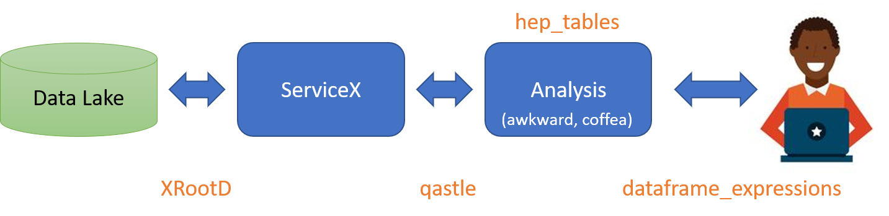

# `hep_tables` - DataFrames over the wire to `servicex`

This site contains a few demos Jupyter notebooks showing some of the ideas behind the [hep_tables](https://github.com/gordonwatts/hep_tables) and [dataframe_expressions](https://github.com/gordonwatts/dataframe_expressions) packages. The two packages work together to allow easy columnar-like access to hierarchial data when the data processing backend is in an analysis facility and the user is using either Jupyter notebooks or python source files to drive the analysis.

While the code has fairly complete tests, it is certainly of prototype quality and coverage (for features you would need for an actual physics analysis). The feature set has been driven by a a small number of tasks that were meant to see what is possible.

- Basic plots should be easy to make
- Single object selection cuts using `numpy` like slicing
- Multiple object combinations

This site is organized into a chapter with the demo notebooks showing off this work, and then followed by some discussion. Skipping to the sections that contain code and then coming back to look at the design goals or the discussion about what has been learned so far is a totally appropriate way to approach this site.

## Design Goals

There are two approaches to analyzing large datasets. One has the physicist dealing directly with coordinating the backend: scheduling, numbers of parallel processors, etc. The other has the physicist manipulate the dataset as a whole, and then let the backend decide how to split the work up.

Each approach has advantages and disadvantages. The first approach means that the user needs to know details that have nothing to with physics, OTOH, they have complete control and can really take advantage of their knowledge of the shape of the data, the layout of the backend they are running on, etc. The latter approach trades these two - the user manipulates the data, and thinks very little about how the data is processed, but then it is very hard to really take advantage of the layout of the system.

Further, it should be noted that the second approach will use the tools developed for the first approach! And any actual solution will almost certainly not be purely one approach or a second approach.

The combination of `hep_tables` and `dataframe_expressions` leans more towards the second approach.

## Where might a prototype end up?

IRL, one would expect the backend to split the query up, the first part would send to `servicex` and get the data, and then the second part would run on that returned data and produce results, something like this: 

A quick description of the various bits:

- _Data Lake_: The experiment's data store. Usually backed by _rucio_.
- _XRootD_: The wire-level protocol used to move files
- _ServiceX_: distributed cloud application that extracts columns of data quickly from experiment's data. Capable of windowing rendered columns with simplified cuts.
- _qastle_: Lisp-like language used to specify columns and simplified cuts
- _Analysis_: The code and collection of services that orchestrates the high level analysis of data (turning ntuples into histograms, running ML, etc.) - likely made up of many parts. Using `awkward` and `coffea` as the backbone most likely.
- _hep_tables_: A package that converts a computational graph into commands to `ServiceX` and `awkward` and `coffea` to do the user's bidding.
- _dataframe_expressions_: A package that enables the user to express data manipulation in a `numpy` like way. It is designed to be transportable over the wire (with a few caveats, see below).

For those of you that know me, you might recognize a few refrains in the demo. I look at HEP data as as sequences. A run consists of a sequence of events. And event consists of different objects - a sequence of electrons, of tracks, of calorimeter cells, etc. Our previous work operated over these sequences using [LINQ like operations](https://docs.microsoft.com/en-us/dotnet/standard/using-linq).

`dataframe_expressions` and `hep_tables` tries to combine the streaming interface and the `numpy` interface - playing to python's strengths where possible, and allowing for simple exensions when one needs to think in terms of streams. The `numpy` interface is optimized for tabular data, not hierarchical data. There are some places where it is easy to extend the `numpy` semantics to address this, and other places where adopting sequence semantics seems more natural.

- Examples of `numpy` like interface: the slicing/masks to select out objects or events; accessing complete columns of data at once. The semantics are extended here, as HEP data is hierarchical.
- Examples of sequence semantics: the `map` function; lambda capture to look at object combinations.

The code is all prototype level. There is no real _Analysis_ component; this work was mostly to see if this approach was feasible, and then collect community comments (please use the IRIS-HEP slack, [#hep-tables channel](https://iris-hep.slack.com/archives/C0109KHNLLT)).

## Acknowledgements

This was build in the context of the [IRIS-HEP](https://iris-hep.org) project.